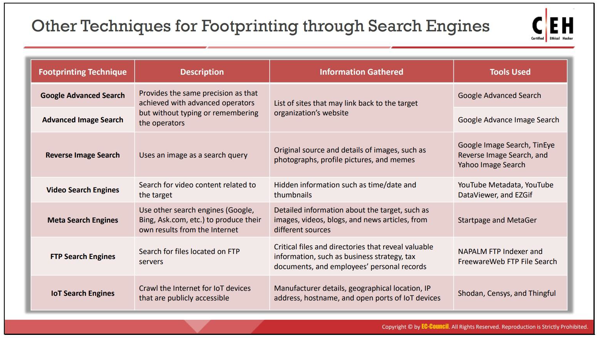

# Search Engines Footprint
## Google Hacking Techniques
- Learn detailed google techniques on [this link](https://www.googleguide.com).
- For google advance search, can also visit this link - [https://www.google.co.in/advanced_search](https://www.google.co.in/advanced_search).
- For google advance image search, can also visit this link - [https://www.google.co.in/advanced_image_search](https://www.google.co.in/advanced_image_search).
- For google reverse image search, can also visit this link - [https://www.google.co.in/imghp](https://www.google.co.in/imghp).

  


## Other Search Tools and Techniques

To Search Video metadata, we can use
- [Youtube Metadata](https://mattw.io/youtube-metadata/)

## Other Search Engines
### Meta Search
Meta search engines are a different type of search engines that use other search engines (Google, Bing, Ask.com, etc.) to produce their own results from the Internet in a very short time span.

Using meta search engines, such as Startpage, MetaGer, and eTools.ch, attackers can send multiple search queries to several search engines simultaneously and gather substantially detailed information such as information from shopping sites (Amazon, eBay, etc.), images, videos, biogs, news, and articles from different sources. Further, meta search engines also provide privacy to the search engine user by hiding the user's IP address.

### FTP Search
Using FTP search engines such as NAPALM FTP Indexer, FreewareWeb FTP File Search, and Globalfilesearch.com, attackers can search for critical files and directories containing valuable information such as business strategies, tax documents, personal employee records, financial records, licensed software, and other confidential information.

  

### loT Search Engines
With the help of loT search engines such as Shodan, Censys, and Thingful, attackers can obtain information such as the manufacturer details, geographical location, IP address, hostname, and open ports of the target loT device. Using this information, the attacker can establish a back door to the loT devices and gain access to them to launch further attacks.

# Finding a Company's Top-Level Domains (TLDs) and Sub-domains

## Use google dorks
We can use following dork to get all subdomains -

```site:microsoft . com -inurl:www```

## Using Netcraft
Source: https://www.netcraft.com

## Using Pentest-Tools
Source: https://pentest-tools.com

## Using Sudomy
It is a python tool and is very effective in finding all subdomains.

# People Search
## theHarvestor
Attackers use theHarvester tool to perform enumeration on Linked In and find employees of the target company along with their job titles.

## Job Sites
Job sites are benificial for searching about a person in detail.

# Determining the Operating System
Attackers use various online tools such as Netcraft, Shodan, and Censys to detect the operating system used at the target organization.

## Netcraft
The technique of obtaining information about the target network operating system is called OS fingerprinting. Open https://www.netcraft.com/tools/ in the browser and type the URL of the target website in the What's that site running? field. Attackers use the Netcraft tool to identify all the sites associated with the target domain along with the operating system running at each site.

## SHODAN Search Engine
Shodan is a computer search engine that searches the Internet for connected devices (routers, servers, and loT.}. You can use Shodan to discover which devices are connected to the Internet, where they are located, and who is using them.

## Censys
Source: https://censys.io

Censys monitors the infrastructure and discovers unknown assets anywhere on the Internet. It provides a full view of every server and device exposed to the Internet

# VoIP and VPN Footprinting through SHODAN

Shodan is a search engine that enables attackers to perform footprinting at various levels. It is used to detect devices and networks with vulnerabilities. A search in Shodan for VoIP and VPN footprinting can deliver various results, which will help gather VPN- and VoIP-related information.

# Gathering Information from Public Source-Code Repositories
Source code-based repositories are on line services or tools available on internal servers or can be hosted on third-party websites such as GitHub, GitLab, SourceForge, and BitBucket. These sites contain sensitive data related to configuration files, private Secure Shell (SSH) and Secure Sockets Layer (SSL) keys, source-code files, dynamic libraries, and software tools developed by contributors, which can be leveraged by attackers to launch attacks on the target organization.

## Recon-ng
Source: https://github.com

Recon-ng is a full-featured reconnaissance framework designed to provide a powerful environment to conduct web-based reconnaissance quickly and thoroughly. It assists attackers in gathering information from public source-code repositories.

# Footprinting through Social Networking Sites
  

## BuzzSumo
Source: https://buzzsumo.com

BuzzSumo's advanced social search engine finds the most shared content for a topic, author, or domain. It shows the shared activity across all the major social networks including Twitter, Facebook, Linked In, Google Plus, and Pinterest.